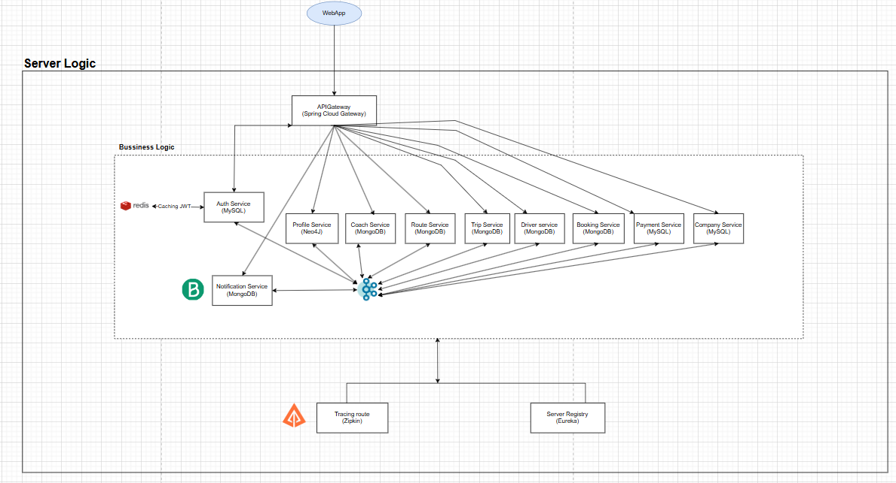

## 1. About this project
- **Project's name:** My Booking Camp
- **Description:** This is a ticket booking system developed using a microservices architecture with Spring Boot and Spring Cloud. The system allows users to book tickets, manage schedules, make payments, and check ticket information.

## 2. Technologies used:
- **Backend:** Spring Boot, Spring Cloud
- **Database:** MySQL, MongoDB, Neo4J, Redis
- **Authentication & Authorization:** Spring Security, JWT
- **Message Broker:** Apache Kafka
- **API Documentation:** Swagger/OpenAPI
- **Containerization:** Docker
- **HTTP Clients:** OpenFeign, WebClientBuilder
- **Tracing:** Zipkin

## 3. System Architecture
**Architecture Diagram:**


**Microservices included:**
- **API Gateway:**  Acts as a centralized entry point for all services, routing incoming requests to the appropriate microservices while handling authentication, logging, and load balancing.
- **Auth Service:**  Manages user authentication, stores account credentials (username and password), and handles user login, JWT issuance, and user roles and permissions across the system.
- **Profile Service:**  Maintains user profile information, including full name, phone number, address, and other personal details.
- **Driver Service:**  Handles driver information management, such as personal details, license information, and driver ratings.
- **Coach Service:**  Manages the fleet of buses, including vehicle type, license plate number, seating capacity, and other essential vehicle data.
- **Route Service:**  Manages route information, including departure and destination locations, route distance, and estimated travel time.
- **Trip Service:**  Defines trip details, such as departure time, arrival time, ticket prices, and available seats for each scheduled journey.
- **Booking Service:**  Handles ticket booking operations, manages seat availability, and tracks booking statuses (e.g., reserved, canceled, completed).
- **Payment Service:**  Processes payment transactions for ticket bookings, validates payment status, and integrates with third-party payment gateways if applicable.
- **Company Service:**  Manages information related to bus companies, including company name, contact details, and service offerings.
- **Eureka Server:**  Acts as the service registry, monitoring the status of all microservices, managing service discovery, and enabling dynamic scaling and fault tolerance within the system.
- **Notification Service:** Sends account verification messages via email by using **Brevo (Sendinblue)** to confirm user registration and provide secure verification links or codes.

## 4. System Requirements
- Java 21+
- Gradle 8+
- Docker

## 5. How to install ?
**Step 1:** Clone this repository:

```
git clone https://github.com/NewBieLearnCode73/My-Booking-Camp.git
```

**Step 2:** Add this project to your IDE (IntelliJ or Eclipse) and config file local1.env in this project

**Step 3:** Run docker compose in this repository

```
docker compose up -d
```

**Step 4:** Start Eureka Server Service

```
cd service-registry
mvn spring-boot:run
```

**Step 5:** Start ther Services
- Start each service individually:

```
cd auth-service
mvn spring-boot:run

cd booking-service
mvn spring-boot:run

cd coach-service
mvn spring-boot:run
```

**Step 6:** Start the API Gateway:

```
cd api-gateway
mvn spring-boot:run
```

## 6. API Documentations
The API documentation is automatically generated using Swagger.
Access the documentation of each service at the corresponding port


